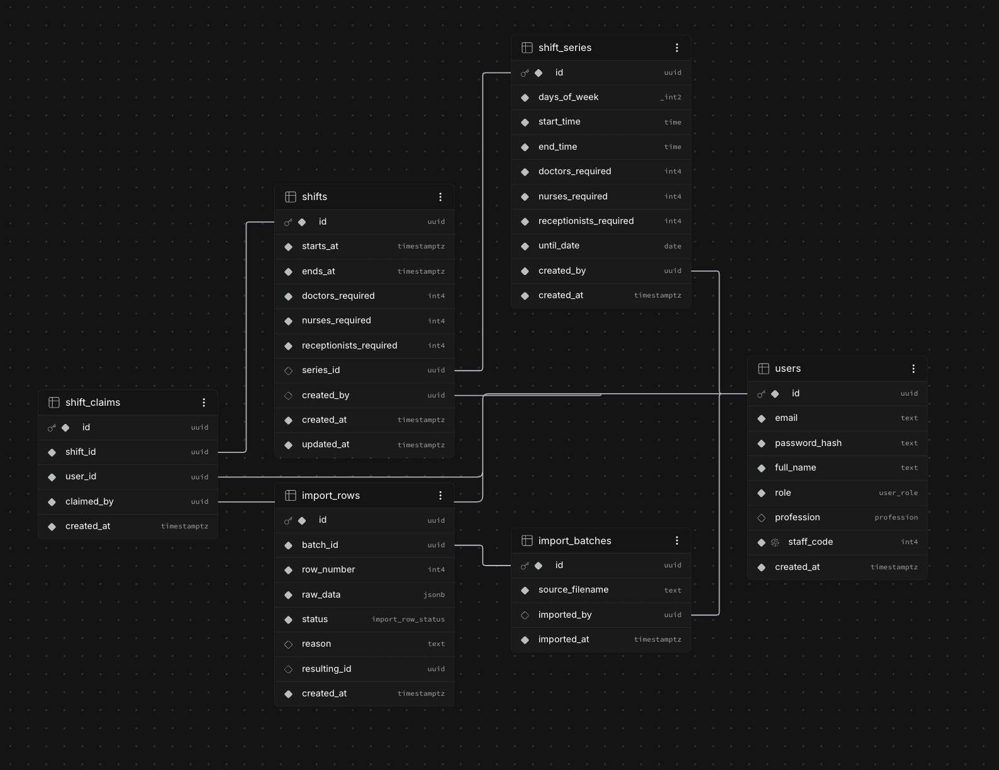

>The focus would be more on the functionality rather than UI 

Problem As I understand it : 

- Need to create a Clinic Shift Scheduler which allows role based acces to staff and manager 
- Both work on something which we call a shift 
- A shift is just the time duration/period on a day in a week with some requirements
- Manager can create shifts and assign it to people and modify it as required
- staff can see all the shifts planned and their required and they can claim/unclaim 
- A data ingestion pipeline from csv to Database directly (only Manager can access it)
- Support for concurrency and Realtime Updates on the dashboard

Okay so that is the overall view of what we actually want... Now how do we actually make it,let's talk in technical terms : 

Tech Stack : `Next.js 16` for both frontend and backend 
For authentication we will keep it simple and use staff_id + email + password flow  and implement it using next-auth
- for this Auth flow there is a bit of problem though : The data given in the staff.csv file doesn't have any password field
So I am assuming that we will be generating the default password for all of the imported users
In a real world scenario we will first verify them the email and send them a magic link to create a new password for their account
But I believe that is not the main focus of this Assignment
Another issue and caveat is that there can exist same emails for different people with different staff_id's and roles. I got this after
looking at these two cases: 
```
107,Hiro Iyer,Receptionist,hiro.iyer@clinicmail.test
998,J. Placeholder,Nurse,hiro.iyer@clinicmail.test
```
So I am assuming that we will need to use staff id as our main unique key
And if two users have the same staff id chances are that they are the same person so we won't  add that again to the database
we will just log it to the manager that this specific entry has been a dublicate so has been merged 

> Also this data will be cleaned up first, but there may exist some malformed or null fields. How do we decide Which fields are important
> and which case should probably not be add to the db ??

Okay we are jumping ships, lets start with a basic structure, One thing at a time.

## Starting with the database schema 
Database of choice : `Supabase Postgres Sql` (It will make more sense later(`Realtime support`)) 

Important entities : 
1. Users
2. Shifts
3. Shift Claims 
4. Import Batches + Import rows(audit trail for each entry)
5. Shift series



Now let's walk through each of the table and why I built it this way 
## Users
```
staff_id,full_name,role,email
121,Marcus Whitfield,Doctor,marcus.whitfield@clinicmail.test
131,Anya Haddad,NURSE,anya.haddad@clinicmail.test
```
After going through requirements I realsied that we need to implement role based Access to the dasboards and there are only two different
roles: Manager and Staff. Staff can have different profession too. So rather than building a seperate table for both I decidded to couple them into table with eight columns: 
`id`:  uuid generated by our backend and its our primary key. See I was thinking what if in future if we have multiple clinics with using a universal id we will still be able to uniquely identify people rather than directly using the staff id

`email`: In a real world scenairo we will first verify this email and then communicate to the user to generate his own new password. So I created an index on the email field too. Notice that we are allowing duplicate emails because from the csv we can see multiple people can have same email. (JUST OUR ASSUMPTION THAT DUPLICATES ARE ALLOWED)

`password_hash`: for now the deafualt password for each new user is "clinic123" which is hashed using bcrypt

`full_name`: Infered from the csv file itself

`role`: Manager or Staff

`profession`: Only field where null is allowed. Manager will have a null profession and staff will have the infered role from the csv

`staff_code`: Our actual unique Identification for a clinic infered from the csv. (I am assigning the staff_code=0 to my manager as of now in future with better signup and login fucntionality that will change accordingly)

`created_at`: For better audit trail


## Shifts
```
shift_id,date,start_time,end_time,requirements
5096,2026-08-28,09:00,17:00,nurses=3;doctors=0;receptionists=0
5053,2026-08-17,08:00,16:00,nurses=3;doctors=1;receptionists=1
```
So after going through the data I decided that Our database will be single source of truth for all and we need to follow consitent formatting. Here is what I eventually stuck with : 

Here is what I eventually stuck with:

`starts_at` / `ends_at` as full `timestamptz` values, not `date + start_time + end_time`
as three separate columns. The CSV has overnight shifts (22:00–06:00, 16:00–00:00) where
end < start on the same calendar date — if I stored them separately, every place that
touches a shift (overlap checks, display, editing) needs a special "did this cross
midnight" branch. Collapsing to two timestamps means an overlap check is one expression:
  new.starts_at < existing.ends_at AND new.ends_at > existing.starts_at
No branching, no edge cases for the overnight ones.

`doctors_required` / `nurses_required` / `receptionists_required` as three integer
columns, not a free-text or JSON requirements field. The CSV mixes structured strings
(`nurses=3;doctors=1`) with at least one row of plain prose ("two nurses and a doctor").
Rather than parsing requirement strings at query time throughout the app, I parse once,
at import time, into three ints — after that the coverage dashboard's "still missing X"
logic is just subtraction, not a string parse.

Import decisions for shifts.csv specifically:
- Ambiguous date formats (ISO, DD/MM/YYYY, MM-DD-YYYY all appear in the same file): try
  ISO first; for the slash/dash formats, disambiguate using any value >12 in either
  position (a date like 08-13-2026 can't be month=13, so that tells me this convention
  is day-first) - reject in this batch, this is a good change.
- Impossible dates (2026-02-30) are rejected outright.
- A start_time equal to end_time (12:00-12:00) is ambiguous — is it a zero-length shift,
  or a typo for a 24hr shift? I reject and flag for manual review rather than guess.
- A missing start_time is rejected — there's no safe default for a shift's start.
- Free-text requirements ("two nurses and a doctor") are rejected rather than
  NLP-parsed — too fragile for a small set of edge cases. Requirement keys the parser
  doesn't recognize just get a reason logged; keys that are present but missing a role
  (e.g. only `nurses=1` with no doctors/receptionists mentioned) default that role to 0.
- An exact duplicate shift_id is treated as a duplicate row and merged/skipped, same
  policy as the staff_id case above.

## Shift Claims
>shift_id,user_id,claimed_by

This table is basically the join between a staff member and a shift they've picked up (or been assigned). I kept it deliberately thin — three foreign keys and a timestamp — because all the actual business logic (does this person already have too many people of their profession, does it overlap with something else they've claimed) lives in the transaction that writes to this table, not in the table itself. The schema's job here is just to make illegal states unrepresentable.

`claimed_by`: this is the field that lets a manager assign someone to a shift and a staff member self-claim through the exact same code path. Both cases insert a row here — the only difference is whether claimed_by == user_id (self-claim) or claimed_by is a manager's id (assigned). I did this on purpose so I only have to write and test the claim-validation rules ONCE, instead of having a separate "assign" function that could drift out of sync with the "claim" function and accidentally let a manager bypass a rule a staff member can't.

`unique(shift_id, user_id)`: this is the part I actually care most about in this whole table. Even if my application-level transaction logic has a bug, or two requests genuinely hit the database in the same instant, Postgres will just reject the second insert outright. So this constraint is my safety net for the concurrency requirement — the "real" concurrency-correctness work happens in the transaction (row lock on the shift, then count claims by profession, then insert), but this constraint means even a worst-case race can't produce a duplicate claim.

## Shift Series
>"every Mon/Wed 08:00-16:00 until 2026-09-30"

This one's for the recurring shifts stretch goal. I went back and forth here — do I store the recurrence rule and compute occurrences on the fly, or do I materialize every occurrence as an actual row in shifts at creation time?

I landed on materializing every occurrence as a real row in shifts, linked back with series_id. My reasoning: the brief explicitly asks for "edit or delete a single occurrence without breaking the series." If occurrences are computed on the fly, editing just ONE of them means I now need some kind of "exception" or "override" record layered on top of the recurrence rule, and my claim/overlap logic has to understand both real rows and virtual/computed rows. That's a lot of extra complexity for a stretch goal. With materialized rows, editing one occurrence is just... editing that one row in shifts. Nothing else needs to know it came from a series.

The tradeoff I'm accepting: if a manager creates a series that runs for a year, that's a year's worth of shifts rows created upfront. For a small clinic this is genuinely fine (a few hundred rows, not millions), so I'm not worried about it.

## Import Batches + Import Rows
>staff_id,full_name,role,email
[garbage row that got rejected]

This pair of tables exists purely to make the Import Report page (manager-only, per the brief) a query instead of something I have to recompute by re-reading the CSV every time someone opens that page.

`import_batches`: one row per import RUN — whether that's the automatic seed import or a manager uploading a fresh CSV through the UI. Same table, same logic, both paths — the brief specifically calls out that the manual upload has to use the same import logic as the seed, so I made sure there's only one import function, and both entry points just call it with a different source file.

`import_rows`: one row per CSV row, no matter what happened to it. I went back and forth on whether to only log the rejected/merged ones (since those are the "interesting" ones), but decided I want ALL of them logged, accepted included. Reasoning: the report needs an accepted count, and I don't want that number to be total_rows - count(logged) — that's the kind of thing that quietly breaks the moment there's a bug in my counting logic elsewhere. Logging everything means "how many accepted" is just count(*) where status='accepted', full stop.

`raw_data as jsonb`: I store the row exactly as it came out of the CSV, before any of my normalization touches it. This is what actually lets me show a manager "here's the exact row, here's what was wrong with it" on the report page, rather than showing them my already-cleaned-up version of a row I decided to reject.

`resulting_id`: nullable, points at whatever got created because of this row (a users.id or a shifts.id). Null if the row was rejected. This is mostly a nice-to-have for traceability — if a manager ever asks "wait, where did this person come from," I can trace it back to the exact CSV row.


> Okay so now that we have the db schema let's move towards the API desgin I stuck with ?

### I thought of api's through solving the main issues that we could have

## Importing data from .csv files 


## Shift claims 


## Editing the shitfts

## Business Logic flow 


# Frontend 
I will not go into much of the detials here, I have only tried to focus much more on the basic functionality..
